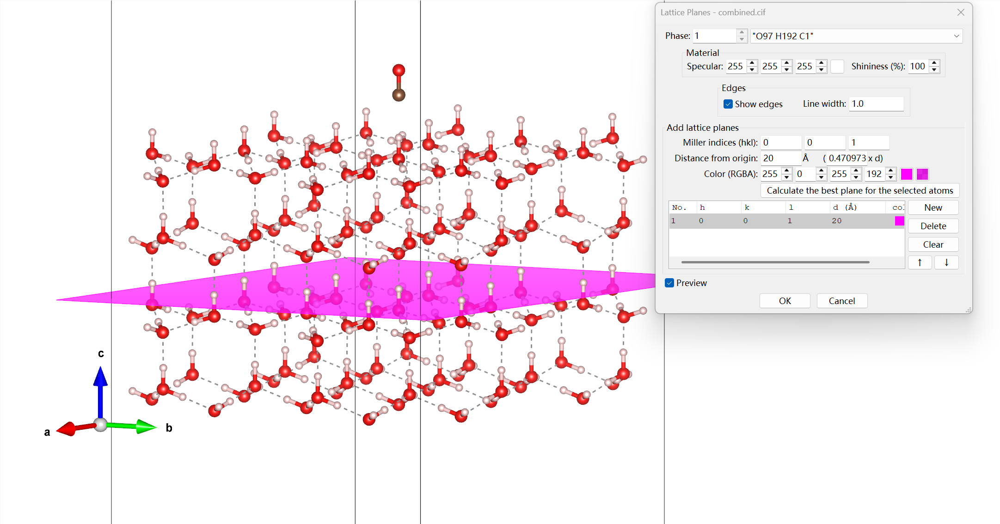

# TL;DR (Too Long; Didn't Read)
> 这篇博客记录了我研究CO分子在六角冰表面吸附的计算化学项目。我使用ASE和TBlite构建了冰晶结构，开发了分子放置和取向算法，计算了结合能，并通过JSON系统记录结果。主要挑战包括收敛性问题、吸附位点选择和分子取向控制。<

# My First Blog Post

## Directory
- [TL;DR (Too Long; Didn't Read)](#tldr-too-long-didnt-read)
- [Workflow Weekly](#workflow-weekly)
  - [Week 1: Setting Up the Environment](#week-1-setting-up-the-environment)
  - [Week 2: Understanding the Theory](#week-2-understanding-the-theory)
  - [Week 3: Solving Technical Challenges](#week-3-solving-technical-challenges)
  - [Week 4: Refinement and Documentation](#week-4-refinement-and-documentation)
- [Background: Cosmic Dust](#background-cosmic-dust)
  - [How People Found Interstellar Ice](#how-people-found-interstellar-ice)
  - [Why Study Ice Surface Adsorption?](#why-study-ice-surface-adsorption)
- [Front-loaded Knowledges](#front-loaded-knowledges)
  - [What is interstellar ice?](#what-is-interstellar-ice)
  - [How to Define Different Crystal Surfaces](#how-to-define-different-crystal-surfaces)
  - [What is Binding Energy and how to calculate it](#what-is-binding-energy-and-how-to-calculate-it)
- [Computational Framework](#computational-framework)
  - [Building Ice Ih Structures](#building-ice-ih-structures)
  - [Creating Surface Slabs](#creating-surface-slabs)
  - [Adsorption Site Identification](#adsorption-site-identification)
  - [Molecule Placement and Orientation](#molecule-placement-and-orientation)
  - [Energy Calculations and Optimization](#energy-calculations-and-optimization)
  - [Automation and Parametric Studies](#automation-and-parametric-studies)
- [Challenges and Solutions](#challenges-and-solutions)
  - [Challenge 1: SCF Convergence Issues](#challenge-1-scf-convergence-issues)
  - [Challenge 2: Selecting Appropriate Adsorption Sites](#challenge-2-selecting-appropriate-adsorption-sites)
  - [Challenge 3: Molecule Orientation Control](#challenge-3-molecule-orientation-control)
- [Results Logging and Analysis](#results-logging-and-analysis)


Today, I started documenting my computational chemistry learning journey. This blog will include:

- My progress in ice surface adsorption simulations
- Python scripting tips
- Challenges and solutions I encounter


## Workflow Weekly

### Week 1: Setting Up the Environment

In the first week, I focused on configuring the development environment on my laptop. Since TBlite is only available through the conda-forge channel, and I already had VSCode and Python installed (if you're starting from scratch, you'll need to download Python and VSCode first, and correctly add Python to your system environment variables), I only needed to:

1. Install Miniconda
2. Create a virtual environment for this research project
3. Select this virtual environment as the interpreter in VSCode
4. Execute the commands to install the required packages (as specified in the requirements.txt file in the main branch)

Although these steps seem straightforward, understanding and completing this setup process took me the entire week.

### Week 2: Understanding the Theory

During the second week, I concentrated on understanding the basic theoretical knowledge of hexagonal ice structure and binding energy calculation methods from various sources, including:
- [Materials Project](https://next-gen.materialsproject.org/)
- [Published research in The Astrophysical Journal](https://iopscience.iop.org/article/10.3847/1538-4357/abb953)
- [Water Structure and Science](https://water.lsbu.ac.uk/water/hexagonal_ice.html)

I also started writing preliminary code and created my own GitHub repository for the project.

### Week 3: Solving Technical Challenges

In the third week, I switched my computing system from Windows to WSL2, which resolved a classic issue where the `get_potential_energy` function wouldn't run on Windows systems with AMD CPUs. I began developing a series of scripts for:
- Building the unit cell
- Cutting out the 001 surface
- Positioning CO molecules at specified adsorption sites
- Optimizing the structure
- Calculating binding energies

By the end of the week, I had obtained some preliminary data.

### Week 4: Refinement and Documentation

In the fourth week, I focused on improving my scripts. I added JSON logging to record experimental parameters and results in detail. I also developed the habit of writing markdown notes to document my work progress and any challenges encountered.


## Background: Cosmic Dust
There is very abundant interstellar medium in the interstellar space. Examples include:

- Dust grains (silicates, carbonaceous materials)
- Ice mantles (water, CO, CO₂, CH₃OH, NH₃)
- Gas phase molecules (H₂, CO, simple hydrocarbons)
- Polycyclic aromatic hydrocarbons (PAHs)
- Atomic hydrogen and helium
- Ions and free radicals

As we all know, the presence of dust in the interstellar medium of galaxies dramatically affects their spectral appearance.

#### How People Found Interstellar Ice
As early as the early 20th century, astronomers began to notice that some stars appeared dimmer than theoretical predictions suggested. In the 1930s, astronomer Trumpler proposed that this was due to the absorption and scattering of light by interstellar dust.

With the development of infrared astronomy, scientists first confirmed the existence of interstellar ice in the 1970s. Through observations of infrared spectra, researchers discovered characteristic absorption peaks of water ice, carbon monoxide ice, and other molecules. These ices mainly exist in star-forming regions and dark clouds, where temperatures often drop as low as 10-20K!

#### Why Study Ice Surface Adsorption?
As a second-year undergraduate student, my research on molecular adsorption on ice surfaces is driven by several compelling factors:

1. **Bridging Observation and Theory**: Astronomical observations provide us with spectral signatures, but understanding what molecules are present and how they interact requires theoretical models. By calculating adsorption energies, we can predict which molecules are likely to stick to ice surfaces under different conditions.

2. **Unraveling Astrochemical Processes**: The interaction between gas-phase molecules and ice surfaces is fundamental to interstellar chemistry. These interactions can lead to the formation of complex organic molecules that may be precursors to life.

3. **Predictive Power**: Computational chemistry allows us to make predictions about systems that are difficult to study experimentally. By calculating adsorption energies, we can predict:
   - Which molecules preferentially stick to ice surfaces
   - How long molecules remain on surfaces before desorption
   - Potential catalytic effects of ice surfaces on chemical reactions

4. **Multidisciplinary Implications**: This research has relevance beyond astrophysics, including atmospheric chemistry, materials science, and even astrobiology.

Through this computational journey, I hope to contribute to our understanding of the molecular processes occurring in the cold, dark regions of space where stars and planetary systems form.

## Front-loaded Knowledges
Before understanding my calculating work, should master some simple but essential conception.

### What is interstellar ice?

Interstellar ice primarily composed of water ice mixed with molecules like CO, CO₂, and CH₃OH. These ices form on dust grains in cold, dense regions of space, creating a platform for chemical reactions that lead to the formation of complex organic molecules. In my study, i main focus on water ice. 
#### Types of Water Ice

| Ice Phase | Crystal Structure | Formation Conditions | Occurrence in Nature | Relevance to Interstellar Ice |
|-----------|------------------|----------------------|----------------------|-------------------------------|
| Ice Ih    | Hexagonal        | Normal pressure, below 0°C | Most common ice on Earth | Dominant form in interstellar ice mantles |
| Ice Ic    | Cubic            | Low temperatures (<150K), vapor deposition | High altitude clouds, comets | Found in cold interstellar environments |
| Ice II    | Rhombohedral     | High pressure (~0.2 GPa), -83°C | Deep ice sheets, icy moons | Rare in interstellar conditions |
| Ice III   | Tetragonal       | Higher pressure (~0.3 GPa), -22°C | Icy planetary interiors | Not commonly observed in space |
| Ice IV    | Rhombohedral     | Metastable phase, ~0.5 GPa | Laboratory only | Not relevant to interstellar ice |
| Ice V     | Monoclinic       | ~0.5 GPa, -15°C | Icy planetary bodies | Not expected in interstellar conditions |
| Ice VI    | Tetragonal       | ~1.1 GPa, room temperature | Deep ice layers of ice giants | Not relevant to interstellar medium |
| Ice VII   | Cubic            | >2 GPa, room temperature | Potentially in ice giants | Not found in typical interstellar conditions |
| Ice VIII  | Tetragonal       | ~2.1 GPa, low temperature | Laboratory only | Not present in interstellar ice |
| Ice IX    | Tetragonal       | Cooling Ice III | Laboratory only | Not observed in space |
| Ice X     | Symmetric cubic  | >60 GPa | Laboratory only | Not formed under interstellar conditions |
| Ice XI    | Orthorhombic     | Proton-ordered Ih, <72K | Possibly in icy moons | Potentially present in ancient interstellar ices |
| Ice XII   | Tetragonal       | ~0.5 GPa | Laboratory only | Not relevant to interstellar ice |
| Amorphous Ice (LDA) | Non-crystalline | Rapid cooling, <120K | Predominant in interstellar space | Most common form in interstellar ice mantles |
| Amorphous Ice (HDA) | Non-crystalline | Pressurized LDA | Laboratory only | Not typical in interstellar conditions |
| Amorphous Ice (VHDA) | Non-crystalline | Higher pressure amorphous | Laboratory only | Not found in interstellar medium |

**Note**: In interstellar environments, amorphous solid water (ASW) and crystalline Ice Ih are the most relevant forms. ASW dominates in the coldest regions due to formation through direct deposition of water molecules onto cold surfaces, while Ice Ih may form when ice is warmed and recrystallized.

In my work, i chose Ih to simulate and calculate.


### How to Define Different Crystal Surfaces

In crystallography, surfaces are defined using **Miller indices**, which describe the orientation of a crystal plane relative to the crystal's lattice axes.

#### Miller Indices Calculation

Miller indices are calculated through the following steps:

1. **Find intercepts**: Determine where the plane intercepts the crystallographic axes (a, b, c).
2. **Take reciprocals**: Calculate the reciprocals of these intercepts.
3. **Clear fractions**: Multiply by the smallest number that will make all indices integers.
4. **Express as (hkl)**: The resulting three numbers form the Miller index (hkl).

For hexagonal systems like Ice Ih, we use a four-index notation (hkil) where:
- h, k, and i are the indices for the three basal axes (a₁, a₂, a₃)
- l is the index for the vertical axis (c)
- The relationship h + k + i = 0 always holds


#### Mathematical Representation

For cubic systems, the equation of a crystal plane with Miller indices (hkl) is:

$$\frac{hx}{a} + \frac{ky}{b} + \frac{lz}{c} = 1$$

For hexagonal systems like Ice Ih, with four-index notation (hkil), the equation becomes:

$$\frac{hx}{a_1} + \frac{ky}{a_2} + \frac{iz}{a_3} + \frac{lw}{c} = 1$$

Where $(x,y,z,w)$ are coordinates, $(a_1,a_2,a_3,c)$ are unit cell dimensions, and $h + k + i = 0$.

#### Key Surfaces of Hexagonal Ice Ih

1. **Basal Plane (0001)**:
   - Intercepts: ∞, ∞, ∞, 1
   - Reciprocals: 0, 0, 0, 1
   - This plane is perpendicular to the c-axis



2. **Primary Prism Plane (10-10)**:
   - In four-index notation: (10-10) where i = -(h+k) = -(1+0) = -1
   - Intercepts: 1, ∞, -1, ∞
   - Reciprocals: 1, 0, -1, 0

3. **Secondary Prism Plane (11-20)**:
   - In four-index notation: (11-20) where i = -(h+k) = -(1+1) = -2
   - Intercepts: 1, 1, -1/2, ∞
   - Reciprocals: 1, 1, -2, 0

The notation (0001) for the basal plane means it's perpendicular to the c-axis and parallel to all three basal axes. This surface is particularly important in ice physics because it represents the stacking direction of the hexagonal bilayers of water molecules in Ice Ih.


**Reference**: This information is based on principles described in ["Experimental and theoretical evidence for bilayer-by-bilayer surface melting of crystalline ice"](https://doi.org/10.1073/pnas.1612893114) (PNAS 114(2), 227–232, 2017).
<!--  -->

### What is Binding Energy and how to calculate it

**Binding Energy** is a fundamental concept in surface chemistry that quantifies the strength of the interaction between an adsorbate (like CO or H₂O molecules) and a substrate (like ice surface). It represents the energy required to remove the molecule from the surface, essentially telling us how strongly molecules stick to the ice.

#### Mathematical Definition

The binding energy (E_bind) is typically calculated as:

$$E_{bind} = E_{adsorbate} + E_{substrate} - E_{total}$$

Where:
- $E_{total}$ is the total energy of the combined system (molecule adsorbed on ice surface)
- $E_{adsorbate}$ is the energy of the isolated molecule
- $E_{substrate}$ is the energy of the isolated ice surface

A positive binding energy indicates a favorable interaction, meaning the molecule prefers to stick to the surface rather than remain in the gas phase.

#### Computational Methods for Calculating Binding Energy

Several computational approaches can be used to calculate binding energies:

1. **Density Functional Theory (DFT)**: The most accurate but computationally expensive method that solves the Schrödinger equation approximately by modeling electron density.

2. **Molecular Dynamics (MD)**: Uses force fields to simulate molecular movements and interactions over time, allowing for temperature effects.

3. **TBlite with GFN2-xTB method**: A lightweight implementation of tight-binding methods that offers a good balance between computational efficiency and accuracy. The GFN2-xTB method is particularly suitable for large systems like ice surfaces with adsorbed molecules.

In my research, I primarily use TBlite with the GFN2-xTB method to calculate binding energies because this combination allows me to efficiently explore multiple adsorption configurations and calculate reliable binding energies without requiring high-performance computing resources, making it ideal for undergraduate research.

Understanding these binding energies is crucial for interpreting astronomical observations and developing models of chemical evolution in star-forming regions.


## Computational Framework

#### Building Ice Ih Structures

The first challenge was to construct accurate ice Ih crystal structures. I used the Atomic Simulation Environment (ASE) Python library to build the ice Ih unit cell:

```python
def buildIh():
    '''Build Ih unit cell.
    The dataset comes from https://next-gen.materialsproject.org/materials/mp-703459?formula=H2O.
    '''
    Ihunitcell = crystal(
    symbols=['O','O','H','H','H'],
    basis=[
        [0.334231, 0.334231, 0.555157],
        [0.667414, 0.667414, 0.430407],
        [0.336017, 0.336017, 0.696031],
        [0.460401, 0.460401, 0.511393],
        [0.792978, 0.669243, 0.478506]
    ],
    spacegroup=185,
    cellpar=[7.50, 7.50, 7.06, 90, 90, 120]
    )
    # Write structure to file
    return Ihunitcell
```

#### Creating Surface Slabs

I then extended this to create surface slabs with specific Miller indices, allowing for variable surface orientations and slab thickness:

```python
def buildIhSpecial(indices=(0, 0, 1), plane=(1, 1, 1), n_bilayers=1):
    '''Build ice Ih slab with specified Miller indices and bilayers.'''
    # [code implementation details]
```

This function allows me to customize:
- Crystal orientation via Miller indices
- Surface size through plane repetition
- Slab thickness by specifying the number of bilayers

### Adsorption Site Identification

One of the more challenging aspects was developing an algorithm to identify adsorption sites automatically:

```python
def find_absorption_site(slab, site_type='ontop', atom_indices=None, distance=2.8):
    '''Find the absorption site on Ih surface.'''
    # Identify surface atoms
    z_coords = slab.get_positions()[:, 2]
    top_layer_z = np.max(z_coords)
    
    # Find surface oxygen atoms
    surface_atoms = [atom.index for atom in slab if atom.symbol == 'O' 
                     and atom.position[2] > top_layer_z - 0.5]
    
    # Handle different site types
    if site_type == 'ontop':
        # Place molecule directly above a surface atom
        # [implementation details]
    elif site_type == 'bridge':
        # Place molecule between two surface atoms
        # [implementation details]
    elif site_type == 'hollow':
        # Place molecule in the center of three surface atoms
        # [implementation details]
```

This function supports three types of adsorption sites:
1. **On-top sites** - directly above a surface atom
2. **Bridge sites** - between two surface atoms
3. **Hollow sites** - centered among three surface atoms

### Molecule Placement and Orientation

I implemented a flexible molecule placement system that allows precise control over the positioning and orientation:

```python
def place_molecule_on_slab(slab, molecule, position, orientation='vertical', 
                          angle=0.0, facing_atom=0, invert=False):
    '''Place molecule on slab with controlled orientation.'''
    # [code implementation]
```

This allows for:
- Different molecular orientations (vertical, horizontal, tilted)
- Rotation angles for non-vertical orientations
- Selection of which atom faces the surface
- Inverted orientations for studying different configurations

### Energy Calculations and Optimization

For energy calculations, I'm using the TBLite semi-empirical quantum methods through ASE:

```python
def calculate(molecule, slab, complex_system, calculator='GFN2-xTB', 
             electronic_temperature=30):
    """Calculate binding energy between molecule and slab."""
    # Create calculators with consistent parameters
    calc = TBLite(
        method=calculator, 
        electronic_temperature=electronic_temperature,
        max_iterations=1500,
        accuracy=1.0,
        mixer=0.05
    )
    
    # Apply calculator to all systems
    molecule.calc = calc
    slab.calc = calc
    complex_system.calc = calc
    
    # Calculate binding energy
    atomsenergy = molecule.get_potential_energy()
    slabenergy = slab.get_potential_energy()
    objectenergy = complex_system.get_potential_energy()
    BE = atomsenergy + slabenergy - objectenergy
    
    return BE
```

### Automation and Parametric Studies

To systematically study multiple configurations, I developed a testing framework that:
1. Allows parameter sweeps through command-line arguments
2. Records all simulation parameters and results
3. Organizes output files systematically

```python
def run_simulation(miller_indices, plane_size, temperature, site_type, 
                  atom_indices, distance, calculator, molecule_name="CO",
                  orientation='vertical', angle=0.0, facing_atom=0, 
                  invert=False, n_bilayers=1, record=True):
    """Run a complete adsorption simulation with specified parameters."""
    # [implementation details]
```

### Challenges and Solutions

#### Challenge 1: SCF Convergence Issues

**Problem:** Initial calculations frequently failed to converge, especially for larger systems.

**Solution:** I improved the convergence by:
- Increasing SCF iterations (max_iterations=1500)
- Adding electronic temperature (30K) to help convergence
- Using a smaller mixing parameter (0.05) for more stable convergence
- Increasing accuracy settings (1.0)

```python
calc = TBLite(
    method="GFN2-xTB", 
    electronic_temperature=electronic_temperature,
    max_iterations=1500,
    accuracy=1.0,
    mixer=0.05
)
```

#### Challenge 2: Selecting Appropriate Adsorption Sites

**Problem:** Initial attempts at automatically finding adsorption sites often selected incorrect atoms or failed on complex surfaces.

**Solution:** I implemented a more robust site detection algorithm with:
- Better surface atom detection
- Fallback mechanisms for when the preferred site type isn't available
- Support for manual atom selection through indices
- Flexible distance parameters

#### Challenge 3: Molecule Orientation Control

**Problem:** Early versions only supported basic positioning, making it difficult to study orientation effects.

**Solution:** I developed a comprehensive orientation system that:
- Handles arbitrary molecular orientations
- Supports specific atom facing directions
- Allows precise angle control for tilted configurations
- Works with both diatomic and more complex molecules

### Results Logging and Analysis

To track and analyze results across multiple simulations, I implemented a JSON-based logging system:

```python
def save_record(params, results):
    """Save test run record to the next available numbered file"""
    record_num = get_next_record_number()
    records_dir = "/home/lihuimin/projects/BEofSpecialMoleculeOnIh/CO/out/records"
    
    # Create record data
    record = {
        "run_number": record_num,
        "timestamp": datetime.datetime.now().strftime("%Y-%m-%d %H:%M:%S"),
        "parameters": params,
        "results": results
    }
    
    # Save to file
    filename = f"record{record_num}.json"
    filepath = os.path.join(records_dir, filename)
    
    with open(filepath, 'w') as f:
        json.dump(record, f, indent=2)
```

This creates a searchable database of simulation results that can be analyzed to identify trends and correlations.

**Stay tuned for more updates!**